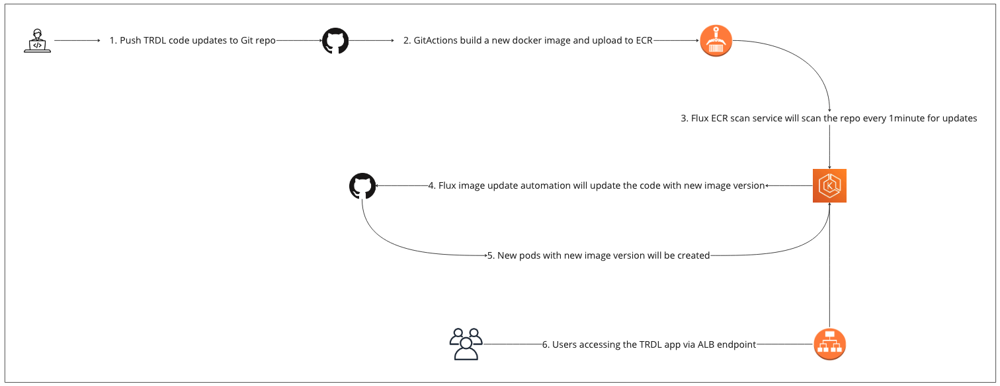

# The Responding Dark Laughter - IaC Repo

This repo contains all the Terraform configurations required to create the AWS infrastructure for the TRDL app. Below is the list of infrastructure components created under this project.

- EKS cluster
- GitHub repo
- Bootstrapping of EKS cluster with Flux (to support CI/CD functions of the TRDL app)
- IAM role (which will use by an EKS service-account to scan a private ECR repo)

## Architecture Diagram

## High Availability

To make sure the TRDL app maintains high availability,

- EKS cluster is setup across 2 AZs
- EKS cluster is configured with an EKS-managed node group of min, max and desired node settings
- TRDL app is deployed in 2 pods across 2 nodes (initial version)

## CICD

From a developer releasing a new version of the TRDL app to provisioning pods with the new version, all the steps are automated and managed by Flux. The Flux repository which contains the flux components as well as manifest files related to the pods, services and ingress can be found at https://github.com/thilan3547/fluxcd-demo-3.

## Log Management

Below log types are enabled at the EKS cluster with a CloudWatch log retention period of 7 days.
- audit
- api
- authenticator
- controllerManager
- scheduler

## TRDL app

Please refer https://github.com/thilan3547/sinch-app for the TRDL app. A GitActions workflow is in place to build the docker image and update it to a private ECR repo.

### Prerequisites

Below components are required to run the project locally,
- GitHub account
- GitHub token
- AWS account and ECR private repo
- Terraform

### Terraform Plan and Apply

- terraform plan -var "github_org=github-user-name" -var "github-token"
- terraform apply -var "github_org=github-user-name" -var "github-token"

### Install the TRDL app components

After completing the Terraform installation, add all the yaml files inside https://github.com/thilan3547/fluxcd-demo-3 -> clusters -> my-cluster -> demo to the new GitHub repository created by Terraform.

Update ecrpolicy.yaml, ecrscan.yaml, imageupdateautomation.yaml and sinchpods.yaml files with your ECR url and docker tag pattern.

## Future Improvements

- Migrate the Terraform state from local to S3 with DynamoDB checksum
- Use a user-friendly FQDN as the customer accessing URL
- Use HTTPS endpoint with an ACM certificate

### Authors

Romesh Samarakoon
